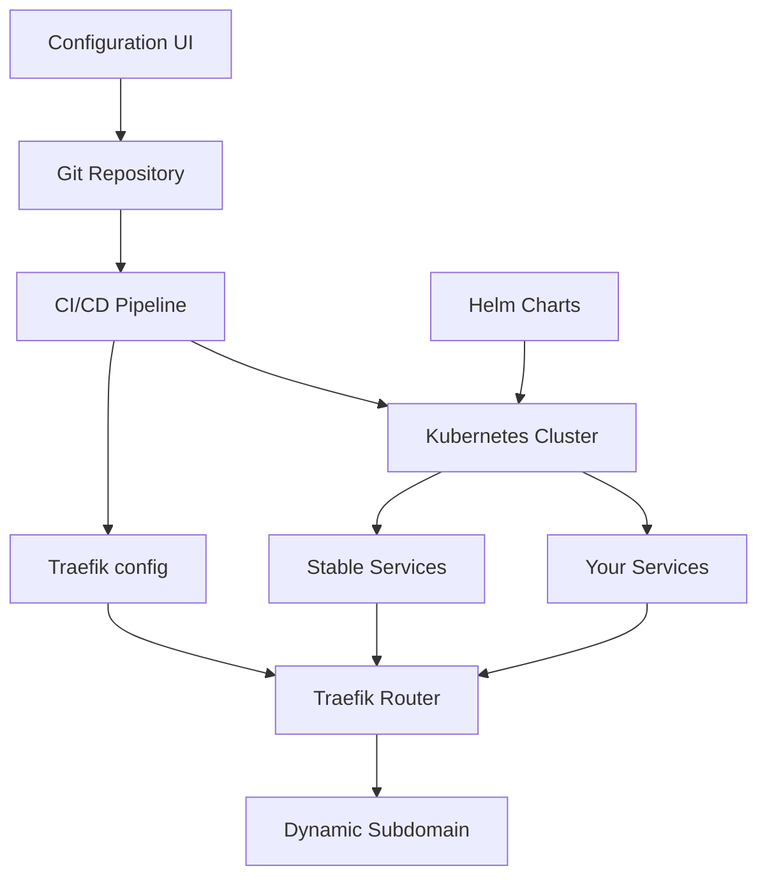

# Динамические стенды разработки
## Опыт mysky.com

---

## О чем эта презентация

В этой презентации мы поговорим о стендах разработки.

А точнее об опыте компании **mysky.com**, в которой я проработал 5 лет.

И том, как мы пришли к **динамическим разработческим стендам** в микросервисной архитектуре с trunk-based подходом и релизом по факту готовности фичи.

---

## Эволюция разработческих стендов

### 1. Классическая эволюция инфраструктуры разработческих стендов на примере mysky.com

**Этапы развития:**

a. `local + stage`
b. `local + stage + prod`
c. `local + dev1-3 + stage + prod`
d. Команд становится несколько, микросервисность (набор сервисов у каждой команды)
e. **devX становится слишком много (у нас было 6), и они не стабильны**

**Проблемы:**
- 🔥 **Конфликты между командами** (сломанная фича одного сервиса не дает тестировать другой команде свой сервис на том же devX)
- 💰 **Высокие затраты на инфраструктуру** (отдельные базы и версия "всех сервисов", хотя некоторым командам столько не надо)

---

### 2. Концепция динамического стенда

**Чем динамический стенд отличается от devX по кнопке?**

✅ **Поднимаем только нужные сервисы** и спариваем с чем-то стабильным (stage)

✅ **По конфигу определяется новый DNS поддомен**, на нем:
- Нужные backend микросервисы
- Нужные микрофронты 
- Остальной "мир" - что-то стабильное (stage)

✅ **Не делаем отдельные базы** для динамических окружений, используем что-то стабильное (stage), там где нужны миграции - идем на devX

---

## Компоненты системы

### Из чего собрать динамические стенды

| Компонент | Описание |
|-----------|----------|
| **Git-based** | Привязка к веткам |
| **Container-based** | Docker/Kubernetes |
| **Helm файлы** | Для описания переменных окружения / деплоя |
| **Traefik** | Скрипт создает конфиг для роутинга |
| **Репозиторий с конфигом** | Одна ветка = конфиг одного динамического стенда |
| **UI для редактирования конфига** | Git авторизация, редактирование JSON из шаблонов |

---

## Что поменяли по итогам 2 лет эксплуатации

### Переход от Stage к Stable

🔄 **Меняем stage на stable:**

- **Stage** → отдаем QA команде
- **Stable** → действительно стабильный, на нем завязаны все динамические стенды

---

## Преимущества динамических стендов

### ✅ Что получили

- 🚀 **Быстрое создание** новых окружений
- 💰 **Экономия ресурсов** - поднимаем только нужное
- 🔧 **Изоляция команд** - нет конфликтов между разработчиками
- 🎯 **Гибкость** - каждый стенд под конкретную задачу

---

## Архитектура решения

## Вопросы?
